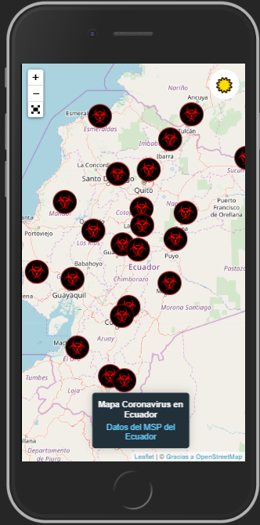
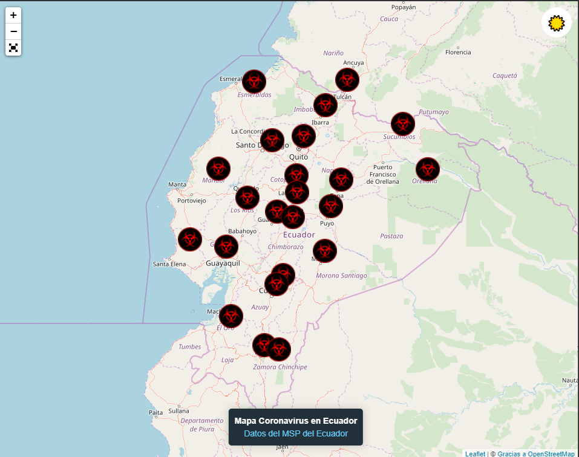

# Coronavirus 2019 EC Mapa

Ejercicio realizado para mostrar un mapa actualizado de las personas afectadas por el coronavirus a nivel de mi Pais Ecuador, usando herramientas como:
- Leaflet 
- Leaflet FullScreen
- Leaflet Edgebuffer

## Como Probarlo

Puedes verlo [aquí](https://coronavirus-ec-sm-2019.netlify.com/) o seguir la guía sobre **Como Utilizarlo**

Puedes verlo algunas estadísticas [aquí](https://coronavirus-ec-sm-2019.netlify.com/estadisticas)

## ¿Como Utilizarlo?

Puedes bajarte el proyecto y ejecutarlo en un servidor web, si tienes NodeJS puedes instalar el paquete **live-server** y ejecutar el comando
```cmd
live-server
```

## Imágenes

**Versión Móvil**


**Versión Web**


**Versión Web**

## Inspiración

Este proyecto fue inspirando en un video genial que hizo el docente **Leonidas Esteban** y que me motivo a realizarlo con la librería Leaflet de manera gratuíta
- Pueden ver la clase original [aquí](https://www.youtube.com/watch?v=UlfacaW8634)
- Pueden revisar el API utilizado en el archivo DB.JSON o [aquí](https://my-json-server.typicode.com/StalinMazaEpn/CoronavirusECApi)

## Autor
> Stalin Maza - Desarrollador Web
- Puedes ver mi blog [aquí](https://stalinmaza97.hashnode.dev/)
- Puedes ver mi canal [aquí](https://www.youtube.com/channel/UCMDvFIXXZv5tUXNa7-qF5pw?view_as=subscriber)

## Nota
Los datos los tratare de actualizar lo mas pronto posible siguiendo los datos oficiales que provee el Ministerio de Salud Publica de Ecuador que los puedes ver [aquí](https://www.salud.gob.ec/actualizacion-de-casos-de-coronavirus-en-ecuador/)